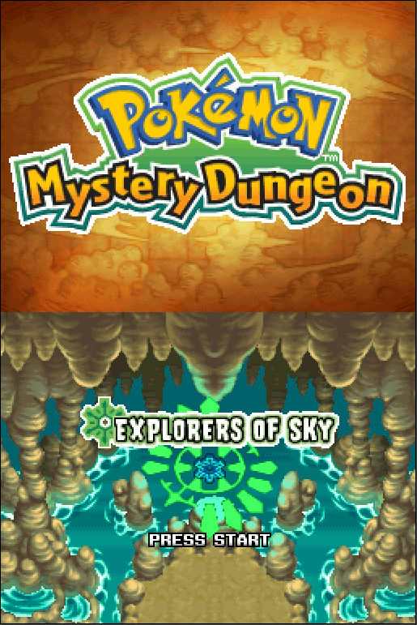
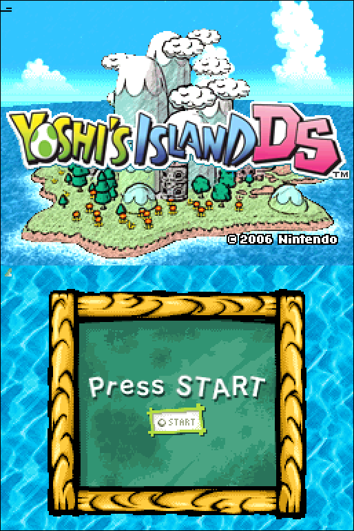
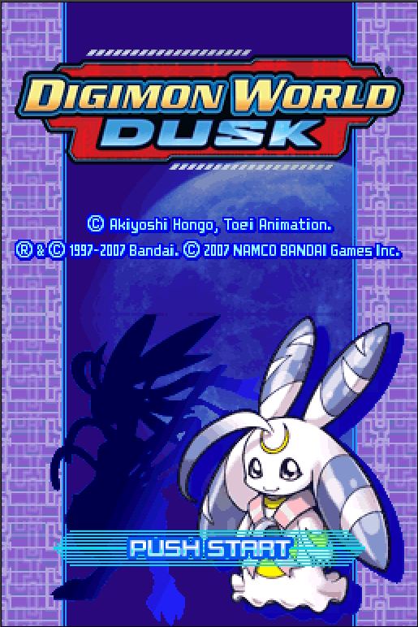
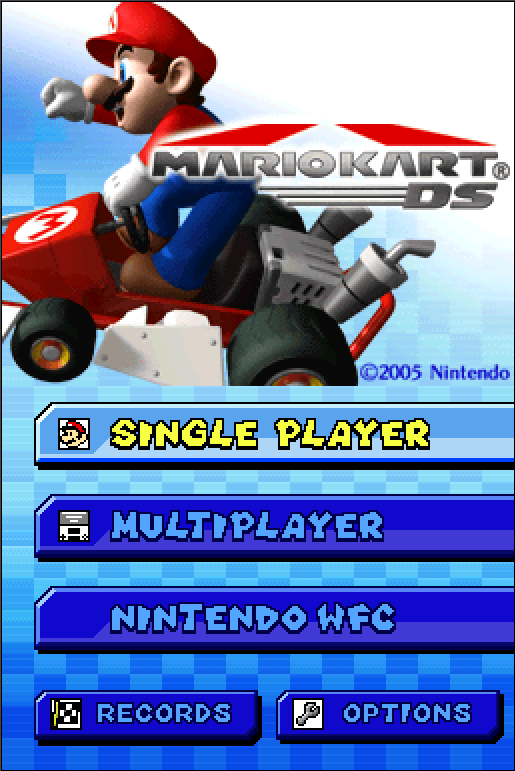

# yuugen

yuugen is a WIP Nintendo DS emulator written in C++

&nbsp;


&nbsp;


## Installation:
Regardless of the platform you're on you will need to have a dump of the ARM7 and ARM9 BIOS as well as the firmware to boot games. However once I implement high level emulation these 3 files won't be required anymore.

## Linux:
1. Install these dependencies:
    ### Ubuntu:
    ```sudo apt install cmake libsdl2-dev qt5-default```

    ### Arch Linux:
    With a package manager such as ```yay```:
    ```yay -S sdl2 qt5-base```
2. Clone the repository:
    ```
    git clone https://github.com/strayacode/yuugen.git 
    cd yuugen
    mkdir build && cd build
    ```
3. Compile:
    ```
    cmake ..
    cmake --build .
    ```
4. Organise folders:

    In the ```yuugen``` directory, place the ```bios7.bin``` and ```bios9.bin``` files in a ```bios``` folder and the ```firmware.bin``` in a ```firmware``` folder. Also make sure to place your dumped ROMs in the ```roms``` folder.

Right now there is no Windows support but that should come in the future

## Roadmap of future endeavours:
- 3D Engine
- Proper CPU timings
- ARM to x86 recompiler
- Resolution upscaling
- HLE of arm7/9 bios and firmware
- Cached interpreter
- Road to perfect 3D graphics
- Support for different platforms (e.g. Android)
- Wifi support
- Further optimisation
- Audio interpolation
- Cheat code support


